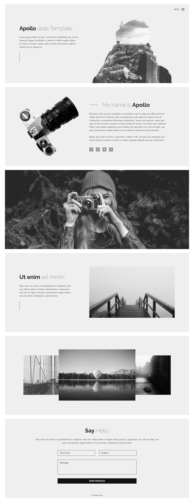


# **Portfolio**
Create a Web page (HTML5 + CSS3 + images) that looks and behaves like the screenshot below:

You are given the above screenshots + all required images.
### **Output**
The output should be valid **HTML5** + **CSS3** + **images** that implement the above web page.
### **Constraints**
- Use Font Awesome for the icons 
- Use font **Raleway (<https://fonts.google.com/specimen/Raleway>)**
- The site should open correctly in the latest version of Chrome

